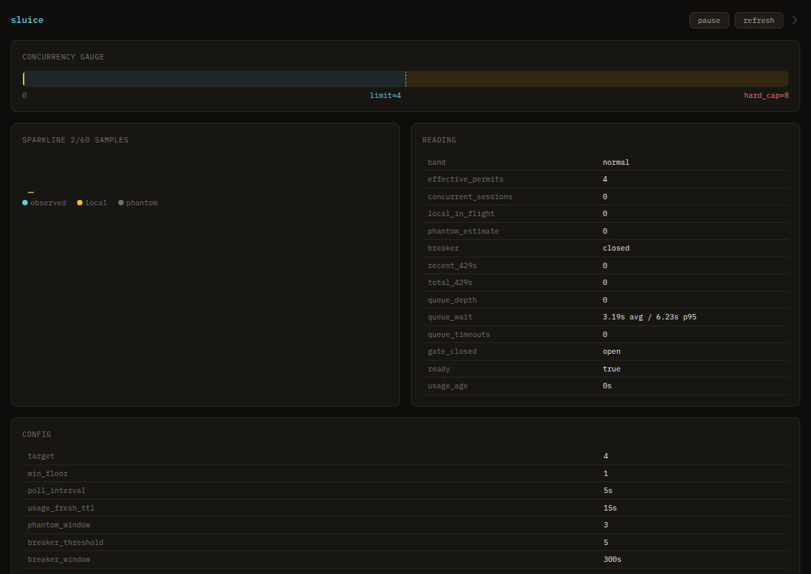

# sluice

A small, central reverse proxy that **meters concurrency** to an LLM API by reconciling
its own in-flight count against the provider's **usage endpoint as ground truth** — so a
fleet of agents on different hosts never collectively exceeds the provider's concurrency
limit and never trips its penalty box.

Built first for **umans Code** (`api.code.umans.ai`), but provider-neutral: any upstream
that exposes a concurrent-sessions reading can be fronted.

```
opencode    ─┐
open-webui  ─┼─▶ [ sluice ] ─▶ umans
hermes      ─┘       ▲
                     └── /v1/usage  (concurrent_sessions = truth, incl. phantoms)
```

## Why this exists

umans Code enforces **concurrency**, not just rate. On Code Max the only meaningful limit
is "requests in flight" (`concurrency.limit: 4`, `hard_cap: 8`; no request window). The
enforcement ladder is:

| Observed `concurrent_sessions` | Consequence |
|---|---|
| ≤ `limit` (4) | normal |
| `limit`..`hard_cap` (4–8) | `priority.low` — deprioritised routing |
| > `hard_cap` (~8) | HTTP 429 concurrency errors |
| daily concurrency-429 allowance exceeded | **boxed** — 5-hour pause (`boxed_until`), limited self-reactivations |

Ladder and numbers per the [official usage docs](https://app.umans.ai/offers/code/docs#usage).
The exact thresholds drift (the docs say the box trips past 10 concurrency-429s a day;
the dashboard currently shows a 20-hit daily allowance) — sluice doesn't hard-code any of
them. It reacts to what `/v1/usage` itself reports (`priority.low`, `boxed_until`,
`priority.reason`), so the ladder can move without a code change.

Two facts make a naive limiter insufficient:

1. **The cap is account-wide, but no single agent knows the global count.** Three agents
   on three hosts each stay under their own ceiling while the *sum* tips over. The only
   place a cross-host invariant can live is one shared choke point.
2. **Phantoms live upstream.** A recent umans bug counted client disconnects as still-live
   requests; those phantoms exist only in umans' counter, so a purely local semaphore
   can't see them. The `/v1/usage` reading can.

sluice is that shared choke point, and it closes the loop against upstream truth.

## What it does

- **One shared semaphore**, every client routes through it — the global concurrency
  invariant in one place.
- **Reconciles against `/v1/usage`.** A background loop reads `concurrent_sessions` and
  shrinks the effective permit count to absorb phantoms it didn't create
  (`effective = target − max(0, observed − local_in_flight)`).
- **Prevents phantoms** rather than only absorbing them: when a downstream client
  disconnects, sluice issues a clean cancel upstream instead of leaving a dangling stream.
- **Respects the box — and knows it from deprioritization.** On a hard box
  (`boxed_until` without `priority.reason = "rate_limited"`) it closes the gate and
  returns `503 Retry-After`, instead of hammering a locked account toward a longer
  pause. On the `rate_limited` rung — where the provider keeps serving at low
  priority — it serves at the account limit (or one below when `--target` already
  sits at the limit) rather than turning a soft penalty into a self-inflicted outage.
- **Both API surfaces.** Transparent streaming passthrough for the Anthropic
  (`/v1/messages`) and OpenAI (`/v1/chat/completions`) routes.
- **Remembers the trend.** Every tick lands in a bounded in-memory history
  (dashboard sparklines + `/history.json`), optionally persisted to SQLite
  (`--history-store`) so a restart doesn't wipe the picture of what led up to it.
  Depth and retention are tunable (`--history-size`, default 2880 ticks ≈ 4h at the
  5s cadence; `--history-ttl` for the SQLite store, default 7 days).
  The dashboard renders it at 5m/1h/4h ranges: a full-width concurrency chart,
  queue depth, a band ribbon, and tick marks where queue timeouts or 429s
  actually happened, with the Reading and Config tables side by side below.
  Legend entries and every Reading/Config row carry hover explanations
  (native tooltips) of what the value means.



*The dashboard under real team load: local in-flight (yellow) repeatedly touches the
effective-permits line of 4 and never crosses it, the excess demand shows up as queue
wait (depth up to 3, `9.71s avg / 20.11s p95`) instead of provider 429s —
`total_429s: 0`, `queue_timeouts: 0` — and the gap between the provider's observed
count (blue) and local truth is exactly the kind of divergence the reconciliation loop
exists to watch.*

## Quickstart

sluice needs an **upstream URL** and an **API key it can use to poll `/v1/usage`** (the same
key your clients send). It listens on `:8800`, serves a live dashboard at `/`, and proxies
every other path straight through to the upstream.

**pip / pipx** (not on PyPI — install from git):

```sh
pip install "sluice @ git+https://github.com/hraedon/sluice.git@main"
export SLUICE_USAGE_KEY=sk-...        # key used only for /v1/usage polling
sluice serve --upstream https://api.code.umans.ai --listen 127.0.0.1:8800
```

**Docker** (the `ENTRYPOINT` is `sluice`, so pass only the subcommand):

```sh
docker build -t sluice:local .
docker run --rm -p 8800:8800 -e SLUICE_USAGE_KEY=sk-... sluice:local \
  serve --upstream https://api.code.umans.ai --listen 0.0.0.0:8800
```

Then point your clients (opencode, open-webui, …) at `http://127.0.0.1:8800` instead of the
provider, and open `http://127.0.0.1:8800/` for the dashboard. See
`docs/client-configuration.md` for per-client setup and `deploy/` for the Kubernetes / ArgoCD
manifests.

## Tuning

| Flag | Default | Effect |
|---|---|---|
| `--target N` | `3` | Concurrency sluice aims to hold (one below umans Code Max's limit of 4). Pass `--target 4` to use the full limit, trading the safety buffer. |
| `--release-cooldown SECS` | `2.0` | How long a freed permit rests before reuse. Prevents the lag race where umans hasn't decremented its counter yet. Set to `0` to disable (maximally aggressive slot reuse, at the cost of transient overshoots on the provider's side). Raise if phantom estimates climb after burst-and-drain churn. |
| `--queue-timeout SECS` | `30.0` | Max seconds a request waits for a permit before receiving a `503`. |
| `--poll-interval SECS` | `5.0` | Seconds between `/v1/usage` polls — the reconciliation loop's cadence. |
| `--reserve LABEL=N` | _(none)_ | Reserves N permit slots for a QoS class (e.g. `interactive=1`). See [QoS reserve](#qos-reserve) below. |

The release cooldown is what makes the dashboard sometimes show queued requests alongside
"free" slots — the slots are freed (`local_in_flight` decremented) but still resting
(`cooling_down` > 0, not yet acquirable). The `cooling_down` count is visible in the
dashboard's stats table and in `/status.json` / `/metrics`.

**Interaction with `--reserve`:** Cooling-down slots reduce the *total* available count
(`capacity - held - cooling_down`), which affects both the shared pool and the reserve.
A cooling-down slot does not "belong" to either pool — it is simply unavailable. Under
saturation with `--reserve interactive=1` and `--release-cooldown 2`, if a reserved slot
is released and enters cooldown, the interactive class temporarily has no dedicated slot
until the cooldown expires. The reserve guarantees *priority of admission* (non-interactive
requests cannot use the reserved slot), not *instant availability* — a just-released
reserved slot still rests for the cooldown period before a new interactive request can
acquire it.

All flags can also be set via environment variables (`SLUICE_TARGET`,
`SLUICE_RELEASE_COOLDOWN`, etc.) or a TOML config file (`--config path.toml`).

### QoS reserve

By default, sluice uses a single FIFO queue — first come, first served. Under saturation
(all permits held), a short interactive request (e.g. a chat turn in open-webui) can queue
behind long-running agent requests and wait up to `--queue-timeout` (30s) before receiving
a 503. This is known and expected at home-lab scale.

`--reserve interactive=1` sets aside 1 permit slot that only requests tagged with the
`interactive` class may use. Non-interactive requests can use the shared pool only, so a
flood of agent traffic cannot drive the interactive class to zero. Below saturation the
reserve is invisible — it only bites when the shared pool is exhausted.

With `--target 3` and `--reserve interactive=1`, agents get at most 2 shared permits and
interactive gets 1 dedicated slot. If the shared pool is free, an interactive request may
use a shared slot too (the reserve is a floor, not a ceiling for the reserved class).

Clients tag themselves by sending the `x-sluice-client-label: interactive` header. sluice
strips this header before forwarding (cache-transparency, Rule 7), so the upstream never
sees it.

### Other providers

sluice is built first for umans Code, but supports other providers via `--provider`:

| Provider | `--provider` | Truth source | Controller |
|---|---|---|---|
| umans Code (default) | `umans` | `/v1/usage` polled every 5s | Concurrency reconciliation (phantom absorption, box awareness) |
| Anthropic | `anthropic` | In-band response headers (`anthropic-ratelimit-*`) | AIMD (reactive — no phantom absorption) |
| OpenAI | `openai` | In-band response headers (`x-ratelimit-*`) | AIMD |
| Generic | `generic` | None (local signals only) | AIMD |

The key difference: umans exposes a live `concurrent_sessions` reading, so sluice can
**prevent** overshoots by reconciling against ground truth. Other providers don't expose
in-flight session counts — sluice can only **react** to 429s and parse ratelimit headers
after the fact. The fail-safe guarantee (uncertainty tightens the gate) still holds, but
precision is reduced off umans. See `docs/concurrency-model.md` §9 for details.

```sh
# Anthropic example — no usage key needed (truth comes from response headers)
sluice serve --provider anthropic --upstream https://api.anthropic.com
```

### Securing the dashboard

By default, the dashboard (`/`), `/status.json`, `/metrics`, and `/history.json` are
unauthenticated. Pass `--admin-token SECRET` (or `SLUICE_ADMIN_TOKEN`) to gate them.
Clients authenticate with either a Bearer token (`Authorization: Bearer SECRET`) or HTTP
Basic auth (password = token, username ignored). The token is stripped from proxied
requests so it never reaches the upstream.

```sh
docker run --rm -p 8800:8800 \
  -e SLUICE_USAGE_KEY=sk-... \
  -e SLUICE_ADMIN_TOKEN=your-secret \
  sluice:local serve --upstream https://api.code.umans.ai
```

### High availability

The concurrency invariant only holds if there is **one** sluice instance admitting traffic.
In a Kubernetes deployment, `--singleton-guard kube-lease` uses a coordination.k8s.io Lease
so that only one pod is leader at a time. Non-leader pods fast-fail with 503 and retry lease
acquisition. The pod needs `POD_NAME` and `POD_NAMESPACE` env vars (set by the Kubernetes
downward API). See `deploy/` for the manifest.

## Why not LiteLLM (or nginx, or a Redis semaphore)?

Because every generic concurrency limiter counts **what you sent** — its own in-flight
requests. sluice counts **what the provider sees** — `concurrent_sessions` from
`/v1/usage`, reconciled every few seconds. That difference is the entire point:

- A local semaphore (nginx `limit_conn`, a Redis counter, LiteLLM's parallel-request cap)
  is blind to **phantoms** — sessions the provider still counts as live after a client
  disconnects. They exist only in the provider's counter, and they're exactly what tips you
  over the cliff. sluice shrinks its own permits to absorb an excess it didn't create
  (`effective = target − max(0, observed − local_in_flight)`); a limiter that only knows its
  own number can't see the gap.
- sluice models the provider's **specific enforcement ladder** — `priority.low` at the
  limit, 429s past `hard_cap`, and the day-scale **penalty box** (5-hour pause, a handful of
  self-reactivations per week). It holds one slot below the cliff and respects `boxed_until`
  instead of hammering a locked account. A generic limiter has no concept of a box.

If your provider doesn't expose a live concurrency reading — or you don't share one account
across hosts — you probably **don't** need sluice; reach for LiteLLM or `limit_conn`. sluice
earns its place only where the provider's own count is the number that punishes you, and
that number can drift from yours.

## Scope

**In:** reverse-proxy data plane (streaming, both surfaces); a deterministic concurrency
controller (bands, reconciliation, permit math); the `/v1/usage` reconciliation loop;
release cooldown + circuit breaker; minimal operational metrics.

**Out:** request *content* inspection, prompt logging, caching, or model routing — sluice
is a concurrency governor, not a gateway. It does not transform bodies.

**Non-goals:** being a general API gateway; per-prompt billing/analytics (that's a separate
observability concern, read-only); reselling concurrency by
key-rotation (sluice exists so you *don't* have to rotate keys or buy a concurrency pack).

## Boundary vs. siblings

- **usage-dashboard** *observes* umans usage (read-only display). sluice *enforces* against
  the same signal (in-path). Clean split: dashboard watches, sluice acts. sluice borrows
  the dashboard's umans-usage parser; it does not depend on the dashboard.
- **ai-concurrency-shaper** (joeycumines, Go) is the off-the-shelf local semaphore +
  cooldown + breaker. sluice borrows those ideas and adds the one thing it lacks:
  reconciliation against the provider's own usage reading. Run the shaper at concurrency=3
  as a zero-build stopgap; sluice is the truth-aware successor.

## Design principles

1. **Deterministic core, no AI in the truth path.** The concurrency decision is pure
   stdlib functions over observed state — testable without a network or a model.
2. **Upstream truth wins.** Local bookkeeping is a fast approximation; the provider's
   reading is authority, and divergence is treated as phantoms to absorb.
3. **Fail safe, not open.** Uncertainty (stale usage, breaker open, box) tightens the gate.
4. **In-path but inert.** sluice gates and cancels; it never reads, stores, or rewrites
   request content.

Status: **1.0 — deployed and live** (internal-only, GitOps via ArgoCD); live-validated against
real streaming agent traffic (opencode → umans on the OpenAI surface: 200s, zero 429s, not
boxed). See `docs/concurrency-model.md` for the data model,
`docs/client-configuration.md` to point clients at it, and `deploy/README.md` for the
deployment and the external-exposure toggle.
